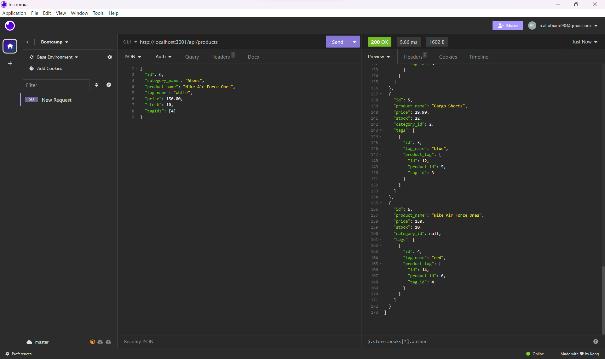

# E-Commerce Back End - Module 13 Challenge
## Description

This app was designed to use Sequelize to interact with a MySQL database. Using models, the app will help to add, make changes
and delete information from the database using the back end in a more efficient way. The app as it stands, uses Insomnia to 
interact with the database.

Developing this app helped me to understand APIs on a deeper level while also learning the value of using models rather than
inputting data directly through MySQL. As we go further into this, I'm starting to understand a lot of the functionality in the
websites we visit everyday and how different elements interact with each other.

## Installation

To use this app, the user opens the terminal and downloads all necessary packages using the command "npm i" From there, the user
the seeds the database and data via "node seeds/index.js" Once the database is uploaded, the user then opens a local server
using "node server.js"

## Usage

The functionality of this app is shown through the use of Insomnia. Once the server is live, you can make GET, POST, PUT, and DELETE requests via Insomnia by using "http://localhost:3001/api/(endpoint)" There are three endpoints to select from: categories, products, and tags. You can edit data in the database using a JSON format.

## Credits

Source code for this project was pulled from coding-boot-camp at https://github.com/coding-boot-camp/fantastic-umbrella

## License

There is no license for this project.

## Link:

[Video of Operation](https://drive.google.com/file/d/1tlO6YPgHKnrTUvwTrAziEa9Q2c6Vc2Mx/view)

## Screenshot of Note Taker Functionality

